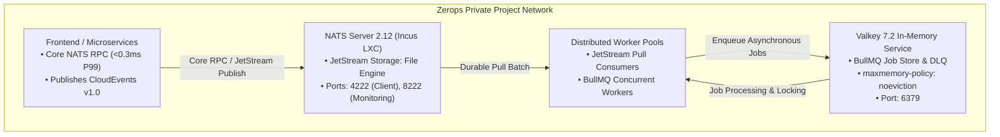

# Automation Engine: Topology & Infrastructure Manual (v2.0)

> **SSoT Reference Document:** `.agents/skills/automation-engine/references/infra.md`  
> **Scope:** NATS Server 2.12 deployment in Zerops Incus LXC, Valkey 7.2 clustering, BullMQ memory tuning, and private service discovery.

---

## 1. Event Mesh Topology in Zerops Incus LXC {#1-infra}

The automation cluster operates on Zerops private network with < 250 MB total RAM footprint across messaging and in-memory caches:



---

## 2. Required Environment Variables

```ini
# ============================================================================
# NATS JETSTREAM 2.12
# ============================================================================
NATS_URL="nats://nats:4222"
NATS_MONITORING_URL="http://nats:8222"

# ============================================================================
# VALKEY 7.2 & BULLMQ
# ============================================================================
VALKEY_URL="redis://valkey:6379"
VALKEY_HOST="valkey"
VALKEY_PORT="6379"

# ============================================================================
# EVENT FABRIC TRACING & IDENTITY
# ============================================================================
EVENT_SOURCE="app.services.core"
EVENT_CLUSTER_REGION="us-east-1"
```

---

## 3. Valkey Memory Tuning Invariant

When running BullMQ on Valkey 7.2, the eviction policy MUST be set to `noeviction`. Under memory pressure, LRU/LFU eviction policies silently delete queue meta-keys and lock keys, causing jobs to hang or duplicate:

```ini
maxmemory-policy noeviction
```
