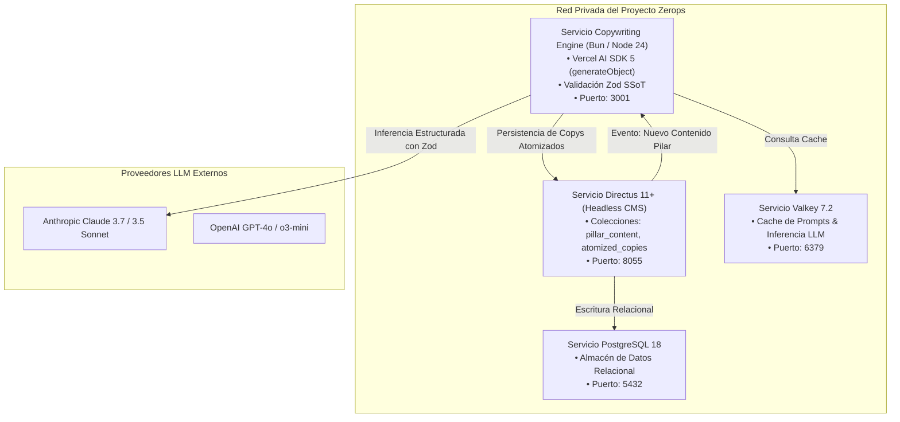

# Copywriting Vanguard: Topología & Infraestructura Zerops (v1.0)

> **SSoT Reference Document:** `.agents/skills/copywriting-vanguard/references/infra.md`  
> **Ámbito:** Motor de inferencia en Node.js 24 / Bun en Zerops Incus LXC, Vercel AI SDK, colecciones en Directus 11+ y cacheo en Valkey 7.2.

---

## 1. Topología del Motor de Copywriting en Zerops Incus LXC

El motor de copywriting opera como un servicio backend AI-First de alta velocidad sobre Node.js 24 / Bun 1.3.9 en Zerops Incus LXC:



---

## 2. Required Environment Variables

```ini
# ============================================================================
# PROVEEDORES LLM (AI SDK 5)
# ============================================================================
ANTHROPIC_API_KEY="sk-ant-api03-..."
OPENAI_API_KEY="sk-proj-..."

# ============================================================================
# INFRAESTRUCTURA ZEROPS
# ============================================================================
VALKEY_HOST="valkey"
VALKEY_PORT="6379"
DIRECTUS_URL="http://directus:8055"
DIRECTUS_STATIC_TOKEN="..."

# ============================================================================
# CONFIGURACIÓN DEL MOTOR
# ============================================================================
DEFAULT_COPY_MODEL="anthropic/claude-3-7-sonnet-20250219"
FALLBACK_COPY_MODEL="openai/gpt-4o"
```

---

## 3. Implementación de Inferencia Estructurada con Vercel AI SDK 5

```typescript
import { generateObject } from "ai";
import { anthropic } from "@ai-sdk/anthropic";
import {
  PillarContentInput,
  OmnichannelAtomizationBundleSchema
} from "../assets/copywriting_zod_schemas";

export async function generateOmnichannelCopy(pillar: PillarContentInput) {
  const { object } = await generateObject({
    model: anthropic("claude-3-7-sonnet-20250219"),
    schema: OmnichannelAtomizationBundleSchema,
    prompt: `
      Actúa como el Director Creativo de Copywriting Vanguard para el mercado de Colombia y Latinoamérica.
      Aplica los frameworks Hook-Story-Offer 2.0, StoryBrand 2.0, Hormozi Value Equation y PASTOR.
      
      Contenido Pilar:
      - Título: ${pillar.title}
      - Audiencia: ${pillar.targetAudience.role} en ${pillar.targetAudience.industry} (${pillar.targetAudience.marketRegion})
      - Dolor Principal: ${pillar.targetAudience.primaryPainPoint}
      - Resultado Soñado: ${pillar.targetAudience.dreamOutcome}
      - Oferta: ${pillar.primaryOffer.name} (Garantía: ${pillar.primaryOffer.riskReversalGuarantee})
      
      Genera la atomización completa para WhatsApp, Email, X, LinkedIn y Video Corto.
    `
  });

  return object;
}
```
