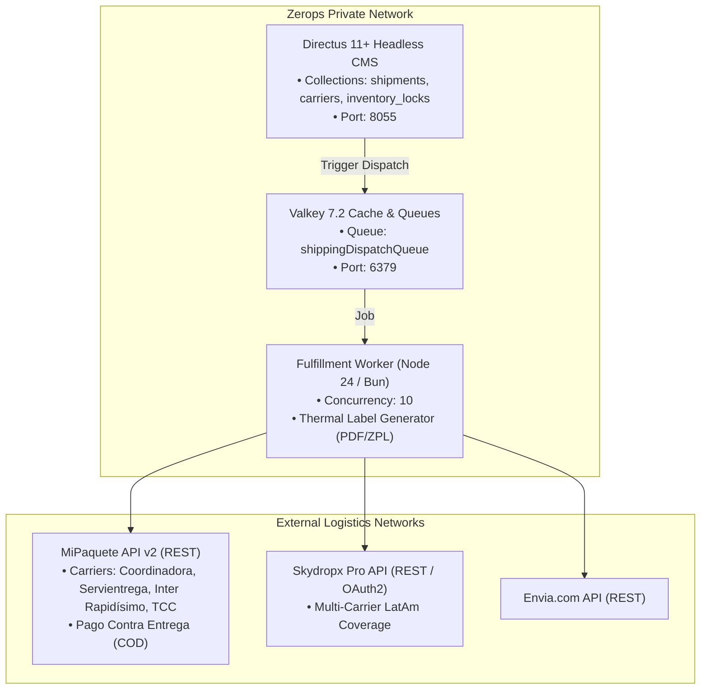

# Orders Fulfillment: Infrastructure, Zerops Topology & Console Runbooks (v2.0)

> **SSoT Reference Document:** `.agents/skills/orders-fulfillment/references/infra.md`  
> **Scope:** Multi-carrier logistics aggregation infrastructure in Zerops Incus LXC, BullMQ dispatch workers on Valkey 7.2, environment variables, and third-party console setup runbooks for **MiPaquete** and **Skydropx**.

---

## 1. Zerops Incus LXC Service Topology



---

## 2. Environment Variables & Zero-Blindness Specification

```ini
# ============================================================================
# AGREGADORES LOGÍSTICOS COLOMBIA & LATAM (RECOMENDADO)
# ============================================================================
# MiPaquete.com (Sin fianza ni estudio crediticio previo)
MIPAQUETE_API_KEY="mp_live_123456789abcdef0123456789abcdef"
MIPAQUETE_DEFAULT_ORIGIN_DANE="05001000" # Medellín

# Skydropx (Multi-Carrier LatAm)
SKYDROPX_TOKEN="skydropx_token_9876543210"

# Envia.com
ENVIA_API_KEY="envia_jwt_token_abcdef"

# ============================================================================
# CONTRATOS DIRECTOS CON TRANSPORTADORAS (OPCIONAL SI TIENES CUPO CORPORATIVO)
# ============================================================================
COORDINADORA_API_KEY="xxxx-xxxx-xxxx-xxxx"
COORDINADORA_CLIENT_ID="123456"
SERVIENTREGA_USER="usuario_sisclinet"
SERVIENTREGA_PASSWORD="password_sisclinet

# ============================================================================
# INFRAESTRUCTURA ZEROPS
# ============================================================================
VALKEY_CONNECTION_STRING="redis://valkey:6379"
DIRECTUS_URL="http://directus:8055"
```

---

## 3. Third-Party Console Setup Runbooks

### 🟡 Runbook 1: MiPaquete.com (`mipaquete.com`)
1. Log in to [MiPaquete Portal](https://app.mipaquete.com) or register a new business account.
2. Navigate to **Configuración** $\to$ **Integraciones / API**.
3. Copy the production **API Key** (`apikey`).
4. In **Datos de Facturación & Bancarios**, configure your bank account for automatic Cash on Delivery (COD) payouts.
5. In **Configuración de Webhooks**, set the callback URL: `https://api.tudominio.com/webhooks/mipaquete`.
6. Save the key as `MIPAQUETE_API_KEY` in Zerops.

---

### 🔵 Runbook 2: Skydropx (`skydropx.com`)
1. Log in to [Skydropx Console](https://pro.skydropx.com).
2. Go to **Configuración** $\to$ **Desarrolladores / API Keys**.
3. Generate a new **Access Token** with permissions for `quotations`, `shipments`, and `labels`.
4. Configure tracking webhooks pointing to `https://api.tudominio.com/webhooks/skydropx`.
5. Save the token as `SKYDROPX_TOKEN` in Zerops.
