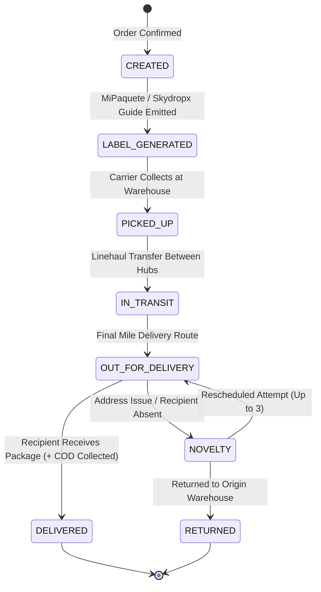

# Orders Fulfillment & Logistics Engine: Usage & Multi-Carrier Adapters (v2.0)

> **SSoT Reference Document:** `.agents/skills/orders-fulfillment/references/usage.md`  
> **Scope:** Multi-carrier shipping aggregation in Colombia and LatAm (**MiPaquete**, **Skydropx**, **Envia.com**), Cash on Delivery (COD / Recaudo) management, DANE 8-digit Divipola geolocation mapping, thermal shipping label generation (ZPL / PDF), atomic PostgreSQL inventory locks, and real-time tracking webhooks.

---

## 1. Unified Multi-Carrier Logistics Strategy (`ILogisticsProvider`)

Instead of coupling directly to legacy carrier protocols, the fulfillment engine uses a unified Strategy pattern:

```typescript
import {
  getAutoConfiguredLogisticsProvider,
  MiPaqueteAdapter,
  SkydropxAdapter,
  QuoteRequest,
  CreateShipmentRequest
} from "../assets/logistics_unified_provider";

// 1. Automatic runtime provider resolution (MiPaquete / Skydropx)
export async function quoteShippingRates(quoteRequest: QuoteRequest) {
  const provider = getAutoConfiguredLogisticsProvider();
  return await provider.quote(quoteRequest);
}

// 2. Dispatch order and generate carrier label with Cash on Delivery (COD)
export async function dispatchOrderShipment(shipmentRequest: CreateShipmentRequest) {
  const provider = getAutoConfiguredLogisticsProvider();
  return await provider.createShipment(shipmentRequest);
}
```

---

## 2. Dynamic Shipping Quote & Carrier Selection

```typescript
const rates = await quoteShippingRates({
  origin: {
    fullName: "Bodega Principal",
    phone: "3001234567",
    email: "bodega@tienda.com",
    addressLine1: "Carrera 43A # 1-50 Local 102",
    daneCode8: "05001000", // Medellín
    cityName: "Medellín",
    departmentName: "Antioquia",
    countryCode: "CO"
  },
  destination: {
    fullName: "Carlos Gómez",
    phone: "3109876543",
    email: "carlos.gomez@gmail.com",
    addressLine1: "Calle 100 # 15-20 Apto 502",
    daneCode8: "11001000", // Bogotá
    cityName: "Bogotá",
    departmentName: "Bogotá D.C.",
    countryCode: "CO"
  },
  packages: [
    {
      weightKg: 1.5,
      lengthCm: 25,
      widthCm: 15,
      heightCm: 10,
      declaredValueCop: 120000,
      contentDescription: "Ropa y Calzado"
    }
  ],
  isCashOnDelivery: true,
  codAmountCop: 120000
});

// Returns sorted rates across Coordinadora, Servientrega, Inter Rapidísimo, TCC, Envía
console.log(rates);
```

---

## 3. Atomic PostgreSQL Stock Reservation Invariant

To avoid overselling or phantom shipments, stock MUST be locked atomically with row-level locks before emitting waybills:

```sql
BEGIN;

-- Lock inventory rows for update
SELECT item_id, available_stock 
FROM inventory_items 
WHERE item_id IN ('SKU-1001', 'SKU-1002') 
FOR UPDATE;

-- Decrement stock
UPDATE inventory_items 
SET available_stock = available_stock - 1,
    reserved_stock = reserved_stock + 1
WHERE item_id = 'SKU-1001' AND available_stock >= 1;

COMMIT;
```

---

## 4. Normalized Tracking Lifecycle & Webhook Architecture


