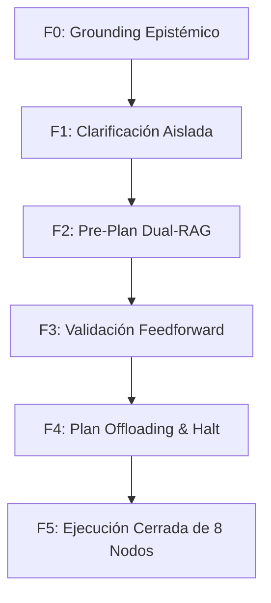

# 🏛️ PLAN ARQUITECTURAL: [TÍTULO DEL PLAN] (v1.0)

> **Marco de Gobernanza Activo:**  
> - [`Supreme Directive`](file:///var/www/.agents/rules/00-SUPREME-DIRECTIVE.md) (Fases F0–F5, Anti-Acción Inmediata)  
> - [`Planner`](file:///var/www/.agents/skills/planner/SKILL.md) (Protocolo Dual-Track & Gobernanza SSoT)  
> - [`Research`](file:///var/www/.agents/skills/research/SKILL.md) (Centinela de Inflow Epistémico Anti-AMN & Recibo `<epistemic_attestation>`)  
> - [`Skill-Improver`](file:///var/www/.agents/skills/skill-improver/SKILL.md) (Centinela de Preservación, Invariante de Cero Eliminación & No-Mutilación en Refactorizaciones de Track A)  
> - [`Ley de Indivisibilidad SSoT (unisetup.sh-first)`](file:///var/www/baiosfera/0ZEROPS-AGY/0zcp-123/scripts/unisetup.sh) (Replicabilidad Limpia Soberana en Contenedor Virgen)  
> - *[Skills Especializadas Adicionales]: Declarar ÚNICAMENTE si la tarea ejecuta su arnés físico y cuenta con un sensor determinista en la Matriz de Control (Sección 5).*  
>  
> **Plan Track:** `[Track A: Skill Governance & SSoT Tooling | Track B: Zerops Workload Deployment]`  
> **Linear Roadmap Sync (Opcional Epics):** `[Linear Issue ID / URL o N/A para tareas locales]`  
> **Estado de Aprobación:** `[Pendiente de Aprobación Human-in-the-Loop (F4 Halt Gate) | En Ejecución]`

---

## 1. Diagnóstico, Evidencias & Epistemic Grounding

<epistemic_attestation>
### Recibo de Grounding Epistémico (F0 Inflow & Evidencias)
- **Recall de Memoria (Engram):** [Resultado de mem_search o mem_context]
- **Motor de Inflow en Vivo:** [Herramienta ejecutada: research subagent / live tools]
- **Fuentes Canónicas & URLs Leídas Verbatim:** [URLs leídas]
- **Evidencias Extraídas:** [Datos o hechos comprobados]
</epistemic_attestation>

---

## 2. Topología de la Máquina de Estados (CoHaLo Fractal)

---

## 3. Invariantes y Reglas No Negociables

1. **Invariante de Dominio:** [Regla de arquitectura o negocio].
2. **Clasificación Dual-Track:**
   - **Track A (Skills):** Modificación de tooling. Requiere `bak/skills/`, 100% Technical English, Semver bump, SSoT mirror a `/var/www/baiosfera/0ZEROPS-AGY/0zcp-123/.agents/skills/` y refresco obligatorio de `skill-registry`.
   - **Track B (Zerops):** Despliegue de workloads. [`bknd`](file:///var/www/.agents/skills/bknd/SKILL.md) y [`frnt`](file:///var/www/.agents/skills/frnt/SKILL.md) operan estrictamente como tablas de enrutamiento y despacho hacia servicios con nombres de host específicos.
3. **Invariante de Cero Eliminación (Skill-Improver):** Toda lógica previa, heurística o especificación técnica se preserva íntegramente mediante modularización a `references/` o `assets/`.
4. **Dual-Anchor Pattern:** Rutas absolutas navegables obligatorias (`file:///`) en encabezado y cuerpo.
5. **Principio unisetup.sh-first & Contenedor Virgen (Track A):** La solución de gobernanza/tooling debe integrarse y ser reproducible en una corrida limpia de `unisetup.sh` en un proyecto virgen sin drift.
6. **Compuerta de Certificación & Invarianza:** Cuando una skill auditada cumple los 5 criterios normativos, se certifica como invariante con 0 bytes de mutación en disco.
7. **Mandato Anti-Desbocado & F4 Halt Gate:** Prohibido por diseño mutar código sin aprobación explícita del usuario ("Go") tras validar el plan con `plan-validate`. El plan es el plano físico indispensable contra alucinaciones y olvidos.
8. **Linear Dual-Track Synergy:** Tareas locales se gestionan mediante el plan en disco sin overhead de red; macro-iniciativas y despliegues completos se sincronizan opcionalmente con Linear para seguimiento persistente multi-sesión.

---

## 4. Plan de Ejecución Inmediato (Paso a Paso — Track A: 8 Nodos Cerrados)

### 🔹 Nodo 1: Backup Pre-Mutación Versionado y Fechado ($N_1$)
- Crear respaldo plano individual en `0zcp-123/bak/skills/<name>_v<ver>_<date>.bak/`.

### 🔹 Nodo 2: Mapeo SSoT unisetup.sh & Generadores Indivisibles ($N_2$)
- Auditar y sincronizar scripts aprovisionadores (`setup-*.sh` / `unisetup.sh`) garantizando paridad en contenedor virgen.

### 🔹 Nodo 3: Bump SemVer & Metadatos Canónicos ($N_3$)
- Incrementar versión en YAML frontmatter (`metadata.version`) y actualizar triggers.

### 🔹 Nodo 4: Refactorización CoHaLo, Cero Eliminación & Positive Guidance ($N_4$)
- Refactorizar router (<750 tokens), modularizar a `references/` sin pérdidas, aplicar formulación afirmativa.

### 🔹 Nodo 5: Espejo Multi-Destino Google Drive SSoT ($N_5$)
- Sincronizar directorio hacia `0zcp-123/.agents/skills/<name>/` con cero drift.

### 🔹 Nodo 6: Atestación por Sensores Físicos ($N_6$)
- Ejecutar `bash scripts/<name>-validate.sh` y suite de validación determinista (`exit code 0`).

### 🔹 Nodo 7: Refresco Forzado de Skill Registry ($N_7$)
- Ejecutar `gentle-ai skill-registry refresh --force` y verificar entrada en catálogo.

### 🔹 Nodo 8: Direct Clean Auto-Purge & Persistencia LTM en Engram ($N_8$)
- Eliminar planes temporales de disco (`rm -f /var/www/artifacts/<plan>*.md`), preservando inviolables los archivos de relevo inter-sesión (`*_handover*.md`, `*_blueprint*.md`, `*_dossier*.md`), y persistir hito en Engram con `mem_save`.

---

## 5. 🚦 Matriz de Control y Criterios de Aceptación (Correspondencia Estricta)

| Nodo / Componente | Ruta SSoT | Backup en `bak/` | Versión Semver | Sensor de Atestación Física | Criterio de Aceptación |
|---|---|---|---|---|---|
| $N_1$: Backup Pre-Mutación | `bak/skills/<name>_v<ver>_<date>.bak/` | Sí (Plano O(1)) | N/A | `test -d <path>` | Directorio verificado en disco |
| $N_2$: Mapeo SSoT unisetup.sh | `0zcp-123/scripts/unisetup.sh` | N/A | N/A | `grep -q <target> unisetup.sh` | Paridad en contenedor virgen |
| $N_3$: Versión Semver | `/var/www/.agents/skills/<name>/SKILL.md` | N/A | **v#.#** | `grep 'version:' SKILL.md` | Versión incrementada en frontmatter |
| $N_4$: Cero Eliminación & CoHaLo | `/var/www/.agents/skills/<name>/` | N/A | **v#.#** | `skill-improver` / `wc -w` | Sin pérdida de directivas, <750 tokens |
| $N_5$: Espejo Google Drive | `0zcp-123/.agents/skills/<name>/` | N/A | **v#.#** | `diff -rq <local> <drive>` | Cero drift en espejo permanente |
| $N_6$: Sensor Físico Individual | `scripts/<name>-validate.sh` | N/A | N/A | `bash scripts/<name>-validate.sh` | Código de salida 0 |
| $N_7$: Skill Registry Sensor | `.atl/skill-registry.md` | N/A | N/A | `gentle-ai skill-registry refresh --force` | Catálogo actualizado exit 0 |
| $N_8$: Auto-Purge & LTM | `/var/www/artifacts/<plan>*.md` | N/A | N/A | `ls /var/www/artifacts/` & `mem_save` | Planes purgados, handovers preservados & LTM commit |

---

## 6. ⚠️ Radar 360° de Daño Colateral y Riesgos Ocultos (Pre-Audit Obligatorio)

### Vector A: Análisis de Causa Raíz de Fondo
- **¿Por qué se solicita esta mutación y cuál es la causa raíz sistémica?**
  [Identificar el problema de fondo que motiva la solicitud, distinguiendo el síntoma superficial de la causa estructural.]

### Vector B: Análisis de Impacto Aguas Arriba y Aguas Abajo (Downstream/Upstream Breakages)
- **Riesgos e Impactos Colaterales Identificados:**
  [Listar los componentes, endpoints, módulos adyacentes, scripts aprovisionadores o pipelines que interactúan con lo modificado.]
- **Medidas de Blindaje y Mitigación Preventiva:**
  [Detallar cómo se evita la rotura o regresión en cada uno de ellos.]

---

## 7. 🔍 Epistemic Surplus: Fracturas Ocultas y Deuda Técnica Detectadas en la Periferia

[Reportar activamente inconsistencias, errores latentes, acoplamientos rígidos o deuda técnica descubierta en la periferia durante la investigación previa que el usuario no había mencionado.]

---

## 8. 🛑 Veto Técnico y Alternativas Arquitectónicas

- **Puntos de Fricción Constructiva / Veto:**
  [Señalar decisiones o enfoques que comprometan la soberanía, estabilidad o SSoT, fundamentando el veto con evidencia técnica.]
- **Alternativa Arquitectónica Propuesta:**
  [Exponer la solución alternativa robusta que ataca la causa raíz y blinda el sistema a largo plazo.]

