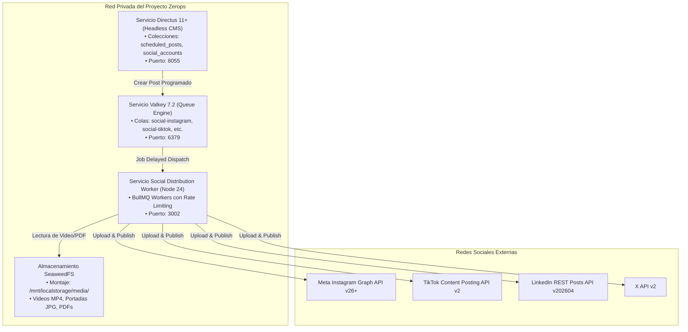

# Social Media Distribution: Topología & Infraestructura Zerops (v1.0)

> **SSoT Reference Document:** `.agents/skills/social-distrib/references/infra.md`  
> **Ámbito:** Motor de distribución en Node.js 24 / Bun en Zerops Incus LXC, Valkey 7.2 para colas BullMQ y SeaweedFS POSIX para medios.

---

## 1. Topología del Motor de Distribución en Zerops Incus LXC

El sistema de distribución corre como un servicio Node.js 24 / Bun en Incus LXC con acceso a almacenamiento persistente SeaweedFS y colas BullMQ sobre Valkey 7.2:



---

## 2. Required Environment Variables

```ini
# ============================================================================
# META / INSTAGRAM GRAPH API
# ============================================================================
INSTAGRAM_USER_ID="17841400..."
INSTAGRAM_ACCESS_TOKEN="EAAX..."
INSTAGRAM_GRAPH_VERSION="v26.0"

# ============================================================================
# TIKTOK CONTENT POSTING API
# ============================================================================
TIKTOK_CLIENT_KEY="aw123..."
TIKTOK_CLIENT_SECRET="sec456..."
TIKTOK_ACCESS_TOKEN="act.xxx..."

# ============================================================================
# LINKEDIN REST API
# ============================================================================
LINKEDIN_CLIENT_ID="78abc..."
LINKEDIN_CLIENT_SECRET="secdef..."
LINKEDIN_ORGANIZATION_URN="urn:li:organization:123456"
LINKEDIN_ACCESS_TOKEN="AQX..."

# ============================================================================
# X (TWITTER) API V2
# ============================================================================
X_API_KEY="key123..."
X_API_SECRET="sec123..."
X_BEARER_TOKEN="AAAA..."
X_ACCESS_TOKEN="tok123..."
X_ACCESS_TOKEN_SECRET="toksec123..."

# ============================================================================
# INFRAESTRUCTURA ZEROPS
# ============================================================================
VALKEY_HOST="valkey"
VALKEY_PORT="6379"
VALKEY_CONNECTION_STRING="redis://valkey:6379"
MEDIA_STORAGE_PATH="/mnt/localstorage/media"
```
